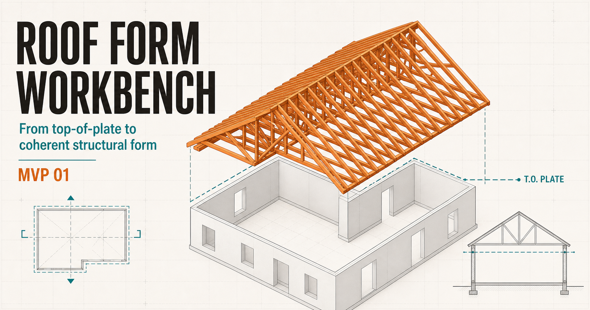

# Roof Form Workbench

An interactive prototype for exploring roof authoring as explicit geometry.

[Open the live workbench](https://roof-form-workbench.abrahamdrechsler.chatgpt.site)



## What it explores

- independent wall paths and closed roof boundaries
- fixed roof base elevation and per-wall plate heights
- direct manipulation of walls and roof eaves in 3D
- rectangular hip-roof topology with variable eave elevations
- reusable parametric eave-detail conditions
- wall clipping without automatically moving the roof
- split, plan-only, and 3D-only authoring views

This is a learning prototype rather than production Higharc code. It is intended
to make the relationships between roof volume, eave geometry, and wall plate
elevations concrete enough to test and discuss.

## Run locally

Requires Node.js `>=22.13.0`.

```bash
npm install
npm run dev
```

Build the production bundle with:

```bash
npm run build
```
